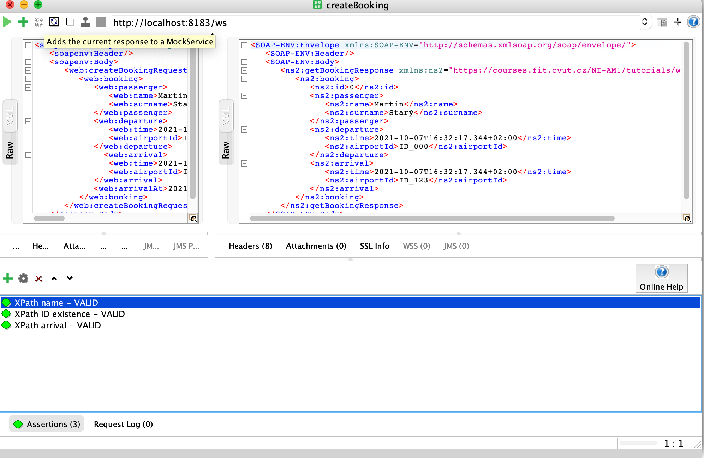
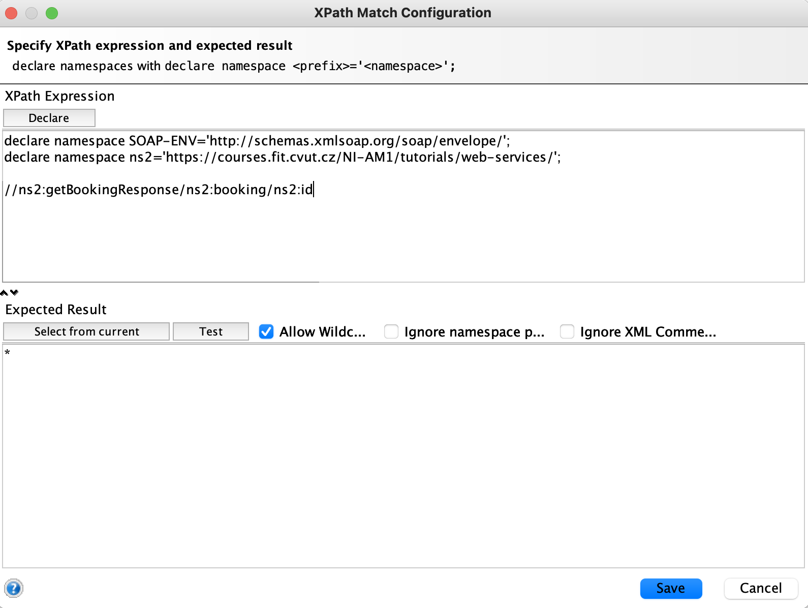
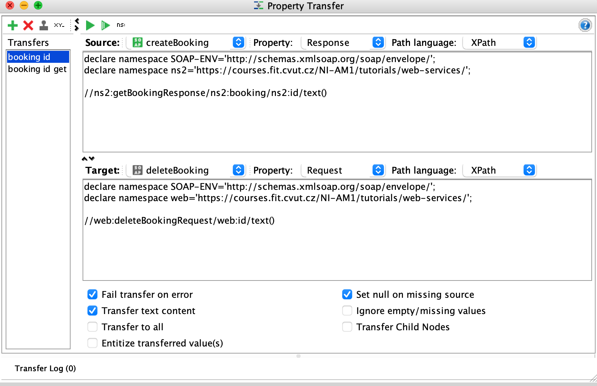
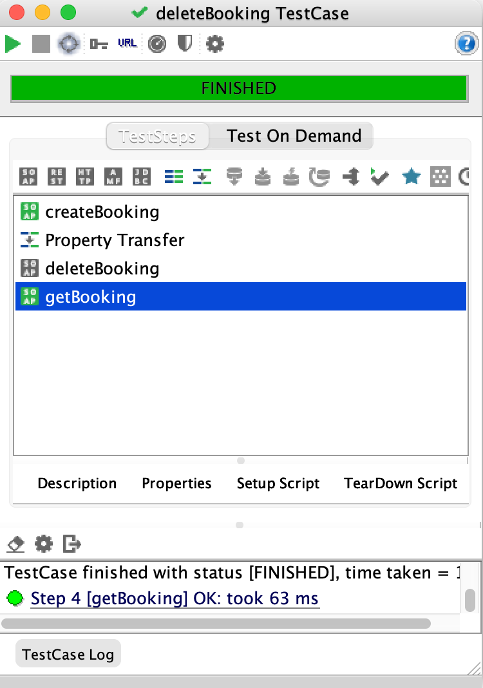
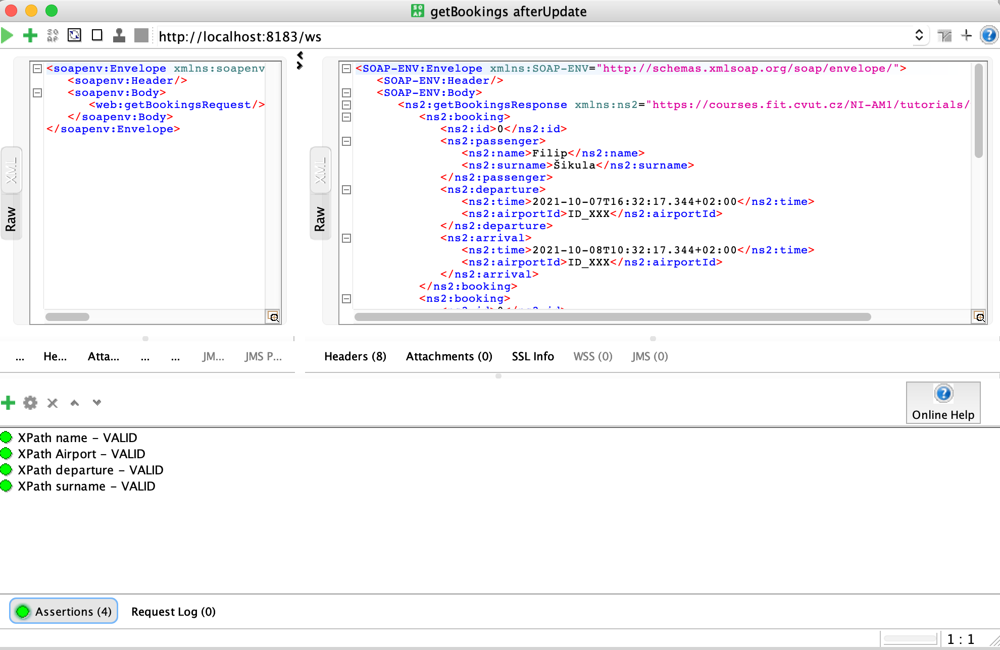

= HW3 - TBD!

# Java
Projekt jsem založil na kázkovém serveru ze cvičení. Nejprve bylo vytvořeno XSD schéma pro jednotlivé datové typy a rozhraní akcí. Následně byla vytvořena implementace jednotlivých akcí a Repozitory pro ukládání. Využity jsou vygenerované datové typy z XSD schématu.

# Soap UI
Následně jsem vytvořil projekt v SOAP UI, do kterého jsem nahrál vygenerované WSDL ze spring serveru na URL http://localhost:8183/ws/bookings.wsdl. Vytvořil jsem testy TestCases pro všechny akce, návratové hodnoty jsou kontrolovány pomocí XPath Match. Pro TestCase u delete operace jsem využil "Property Trasfer", který umožnil předat ID vytvořené rezervace z předchozího create požadavku do následného delete.

## Screenshots

