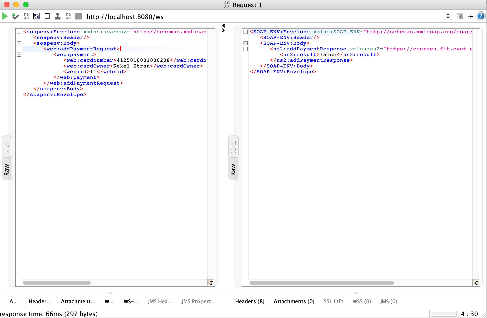
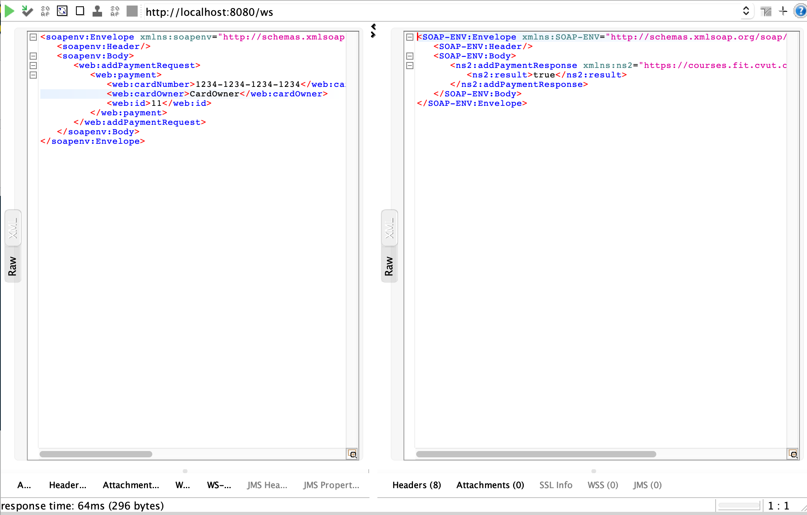
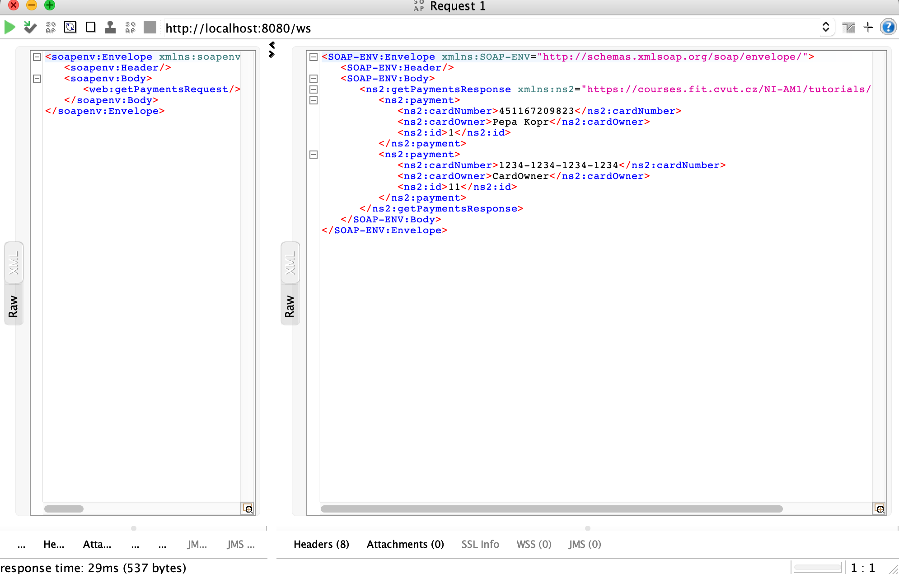

= HW4 - TBD!

# Java

Projekt jsem založil na kázkovém serveru ze cvičení. Nejprve bylo vytvořeno XSD schéma pro jednotlivé datové typy a rozhraní akcí. Následně byla vytvořena implementace jednotlivých akcí a Repozitory pro ukládání. Vygenerován klient pro komuniakci s webovou službou z příslušného wsdl schématu a zakomponování kontroly před přidáním do repository.

# Soap UI

Následně jsem vytvořil projekt v SOAP UI, do kterého jsem nahrál vygenerované WSDL ze spring serveru na URL http://localhost:8183/ws/payments.wsdl. Vyzkoušel jsem validní a nevalidní data + zobrazení všech plateb.

## Screenshots

