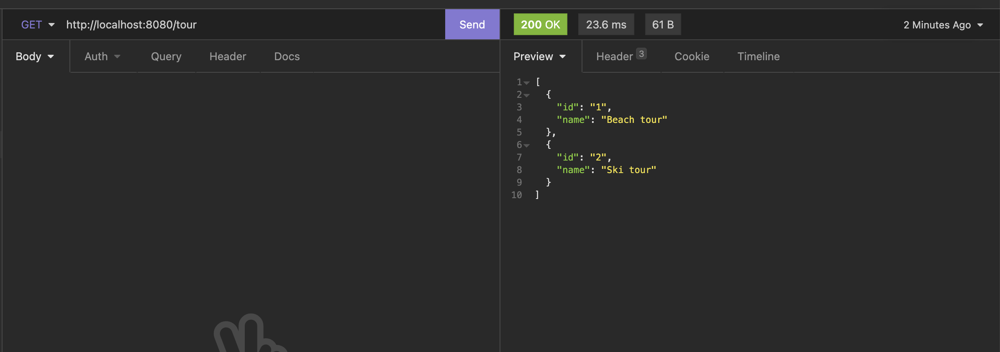
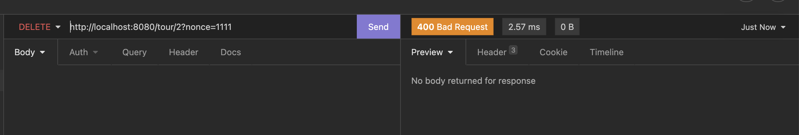
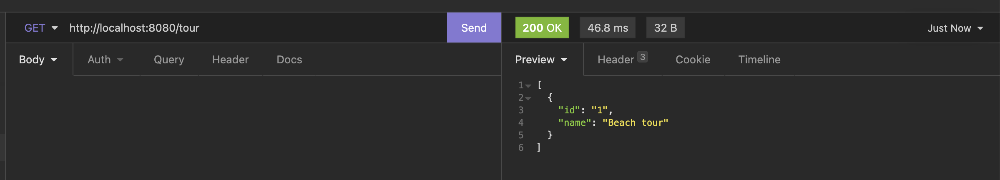

= HW6 - TBD!
Implementaci jsem provedl podle toho, jak jsem porozuměl zadání. Na cvičení jsem se dozvěděl, že jsem to nepochopil úplně správně, ale asynchronní operace implementována je. Zvážil bych změnu textace zadání, aby bylo více srozumitelné.

# API design

`/tour/{id}/confirmation`

-   POST - retrieve confirmation nonce
    -   Status codes: 200
    -   return nonce in body as string

`/tour/{id}`

-   DELETE - retrieve confirmation nonce
    -   Status codes: 200
    -   Query parameter
        -   nonce - required
    -   Status codes: 400, 204

## Implementace

Server obsahuje naivní implementaci asynchronní operace delete. Pro zavolání Delete endpointu určité tour, je potřeba nejdříve zavolat Endpoint pro získání `confirmation nonce`, která slouží jako unikátní identifikátor a je uložená na server. Při volání `delete` operace musí klient přiložit tuto `nonce` k požadavku. Na serveru je následně zjištěno zda daná `nonce` existuje, pokud ano, tak je zdroj smazát, pokud ne tak je vráceno 400.

Implementace je naivní - není řešena kryptografická bezpečnost `nonce`, úložiště je řešení Listem - může dojít k vyčerpání paměti. `nonce` není nijak svázána s daným `id` tour. Lepší řešení by bylo do nonce přidat i `id` a vytvořit kryptografickoou hash - takto by ji klient nemohl podvrhnout. Toto řešení je ale dostačující pro demonstraci asynchronní operace.

## Testování

