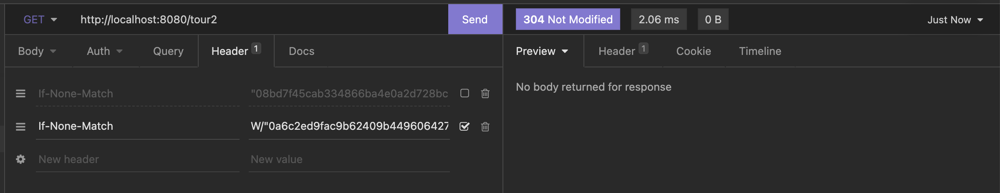
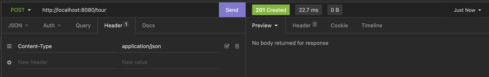

= HW7 - TBD!

Pro implementaci Etag jsem využil `ShallowEtagHeaderFilter`, která řeší vše za mě. Pro implementaci Weak Etag jsem musel řešit implementaci ručně s výpočtem Etag a porovnáním.

-   /tour - využívá Etag
-   /tour2 - využívá weak Etag

Get without etag

Get with etag

Get without weak etag

Get with weak etag

Add tour

Get with etag on modified
