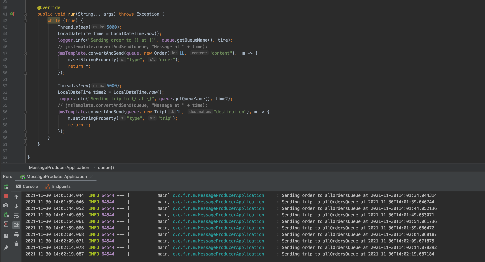
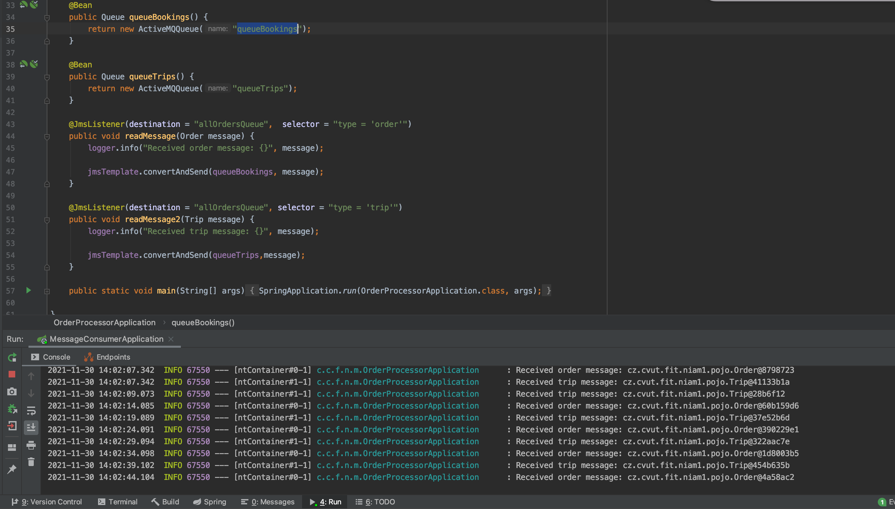
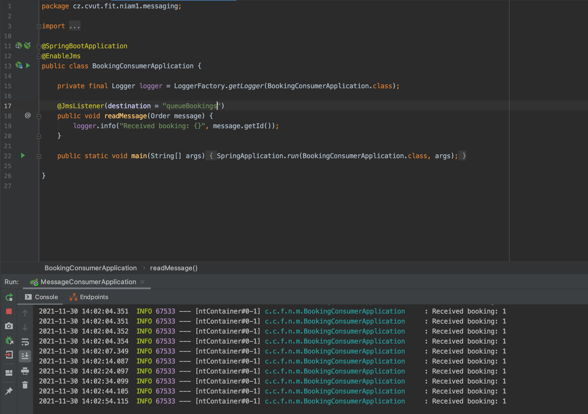
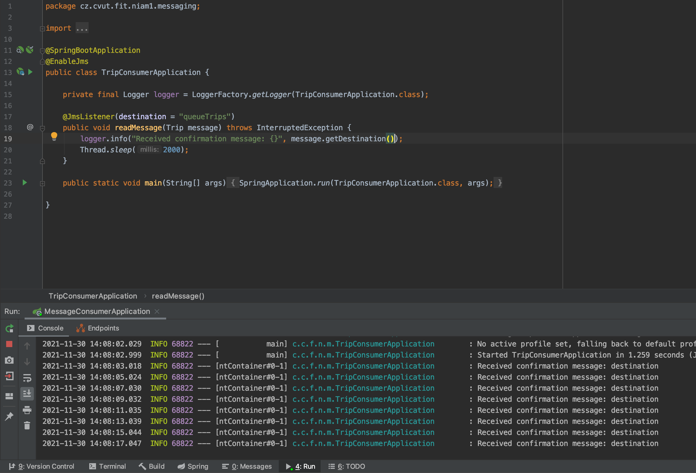

# Implementace

Řešení bylo implementování ve frameworku Spring:

-   order-producer
    -   generuje zprávy typu Trip a Order do jedné společné fronty, zprávám přidávám property type=order/trip
    -   spouští activemq broker
-   order-processor
    -   zpracováná objednávky ze spolešné fronty - zprávy rozpozná pomocí selectoru
    -   přeposílá zprávy do příslušných cílových front - queueTrips/queueBookings
-   booking-consumer
    -   zpracovává objednávky (bookings)
-   trip-consumer
    -   zpracovává výlety (trips)

> Vím že posílání Objektů v rámci message není doporučené, ale chtěl jsem si to vyzkoušet, když Java cpe objekty všude :)

## Ukázky

Order-producer

Order-processor

Booking-consumer

Trip-consumer
