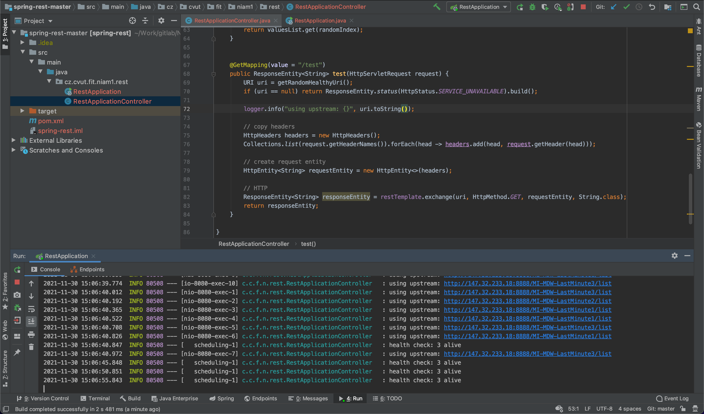

# Implementace

Řešení bylo implementováno ve frameworku Spring. Pro health check je využit Scheduling ze springu. Ve výchozím stavu je sync, takže by nemělo dojít k race condition. Ze zdravých instancí se vybírá náhodně - lepší rozložení zátěže, při kterém nemůže útočník záměrně přetížit jeden ze serverů jako v případě round-robit.

## Ukázka

Ukázka
