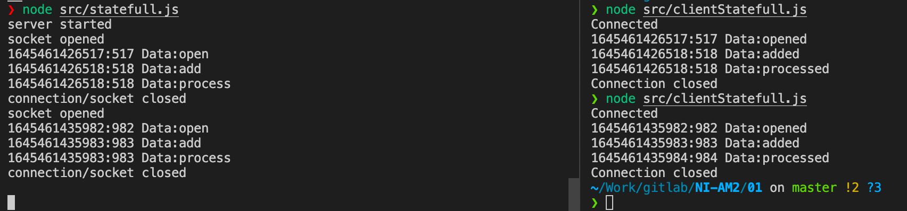
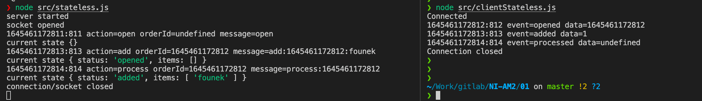

# HW1 - TBD!

Server si udržuje aktuální stav v globální proměnné a reaguje pouze na příkaz, který může přijít v daném stavu. Byla implementována jak Stateless, tak i Statefull varianta - server + příslušný klient.

## Statefull

Nově připojenému socketu je vždy přiřazeno unikátní ID, které je použito pro identifikaci danné session pro kterou se zpracovávají příkazy.

Statefull server a klient

## Stateless

Klient pošle "open" a v odpovědi obdrží číslo otevřené obědnávky. Toto číslo pak klient posílá s každým dalším příkazem, aby server věděl se kterou objednávkou (session) má pracovat dle příkazů.

Stateless server a klient
