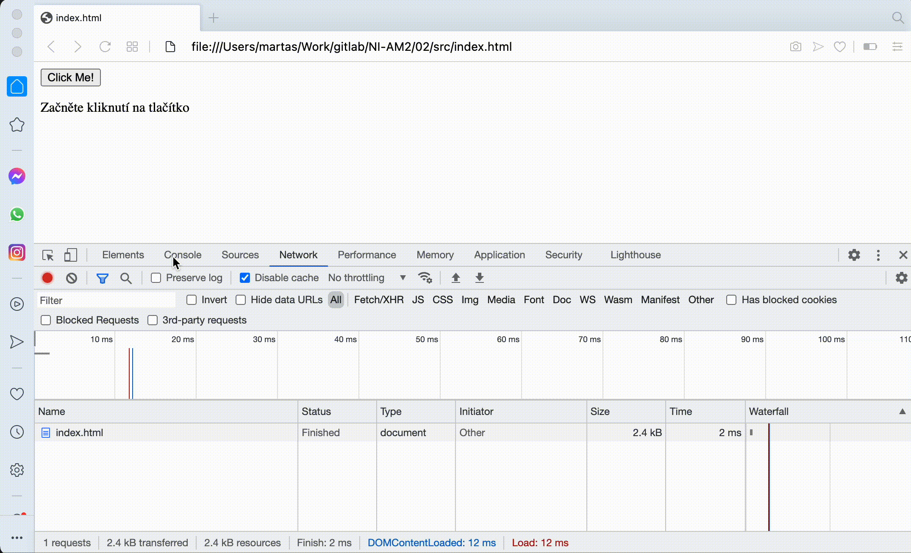

# HW2 - TBD!

Pro stažení souboru je využit XMLHttpRequest. Pro reakci na události je použito novější API v podobě addEventListener, elementy v DOM jsou získány pomocí querySelector.

### Doporučení

V dnešní době, kdy všechny prohlížeče vynucují CORS a není jednoduché něco stáhnout jako JS klient z veřejných stránek by bylo opravdu hezké, kdyby jste do zadání přidali odkaz na nějaký větší soubor se správně nastavenými CORS - kdo to nezná, tak s tím bude strašně bojovat.
