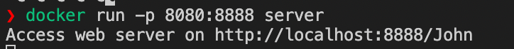
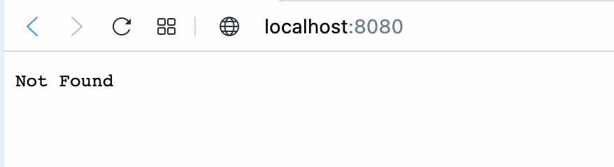
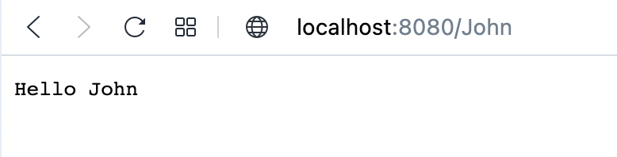
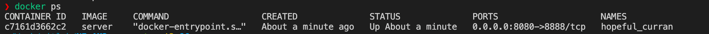

# HW3 - TBD!

Docker image je založena na `node:16-alpine3.11`. Pro http server je využit webový framework `Koa`.

## Příkazy

```bash
docker build -t server  .

docker run -p 8080:8888 server

docker ps
```

# Screenshots








