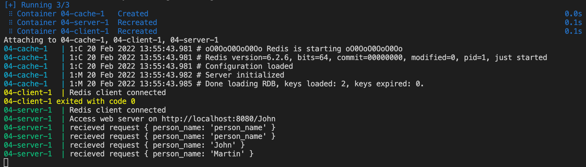

# HW4 - TBD!

Pro efektivnější správu kontejnerů jsem využil docker-compose. Spouštěné kontejnery:

-   cache - Redis databáze
-   client - připojí do redisu a vloží data
-   server - spustí http server a na url http://localhost:8080/person/{person_name}/address vrací adresu z DB dle person_name.

Data v DB:

-   person:John -> "Thakurova 9, 160 00, Prague"
-   person:Martin -> "Letohradská 15, 166 00, Plzeň"

## Screenshots

