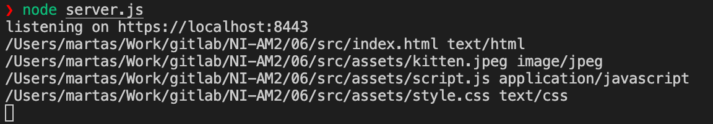
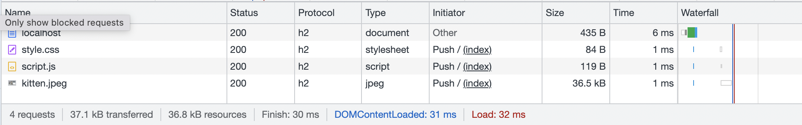
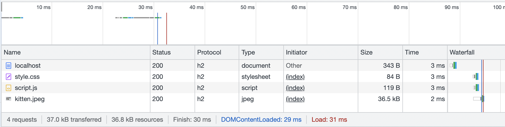
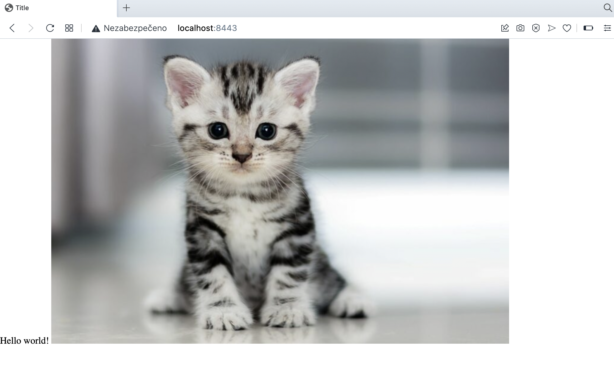

# HW6 - TBD!

Byl využit http2 modul a balíček `mime` pro získání content-type z názvu souboru. Lze přistoupit na `https://localhost:8443` nebo `https://localhost:8443/index.html` a server pošle index.html + (kitten.jpeg,script.js,style.css) pomocí PUSH.

## Screenshots

Push - je vidět, že soubory jsou obdrženy současně s index.html

Bez Push - na localhost budou rychlosti stejné, ale je zde viditelné zpoždění zahájení requestů pro další zdroje pro které jsou odkazy v html

