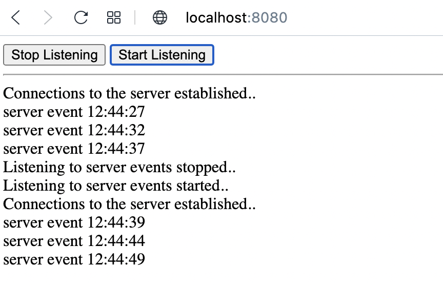
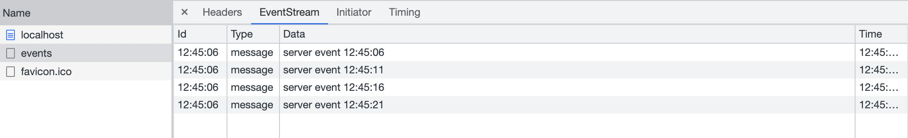

# HW7 - TBD!

Pro implementaci byl využit `http` modul. Server vrací na všechny požadavky `index.html`, pouze na url /events a accept hlavičkou `text/event-stream` vytváří event stream, kam odesílá zprávy každé 2 vteřiny - funguje nezávisle pro paralelní připojení. Html stránka umožňuje pomocí tlačítek zrušit odebírání událostí a opět se přihlásit k odběru.

Ukázka HTML stránky

Ukázka z DevTools network
