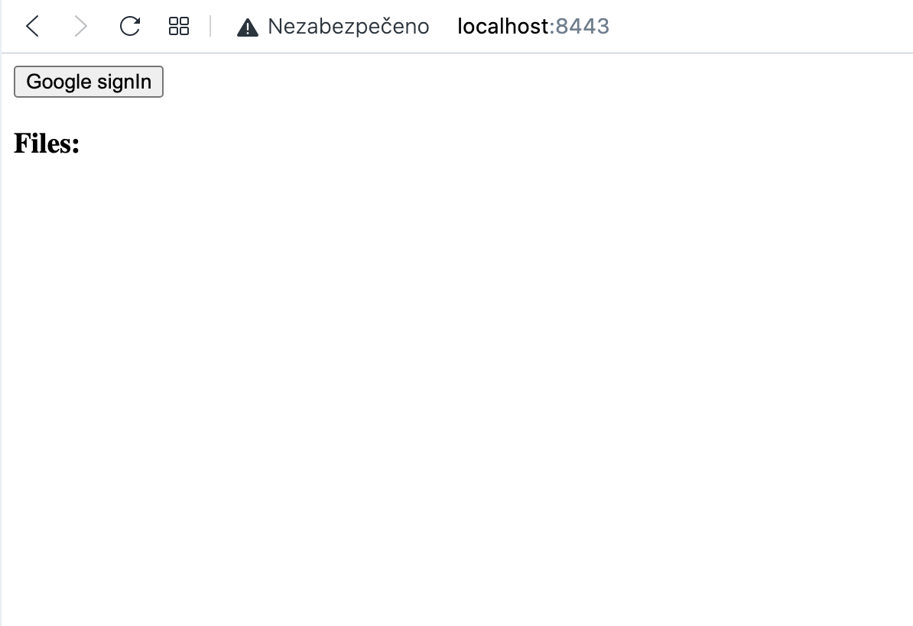

# HW8 - TBD!

Implementovaný server slouží pouze pro načtení index.html - to jak na url `/`, tak i `/callback` - ten je využit jako redirect_url pro oauth. Tedy jsem z toho udělal SPA. Oauth je implementováno od Google poskytovatele. Scope požaduji `drive.metadata.readonly`, který mi umožní získat seznam souborů, které má uživatel na Google Drive.

Nejprve je stránka prázdná - pouze s tlačítek "Google SignIn". Po kliknutí je uživatel přesměrován na Oauth endpoint pro přihlášení k google účtu a získání souhlasu. Následně je přesměrován na redirect_url - což je https://localhost:8443/callback - hash parametr url obsahuje access_token a token_type, které pomocí JS vyparsuji, uložím do `localStorage` a přesměruji stránku na `/` - abych "vyčistil" url. Stránka pokud má v localStorage token, tak udělá request na Drive API a získá seznam souborů, které následně zobrazí na stránce.

Prázdná stránka

Oauth souhlas

Stránka po získání tokenu

DevTools network
