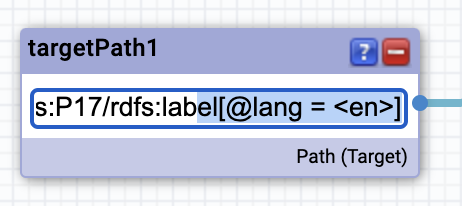

# Poznatky

## Silk

Při procházení zdrojového kódu jsem našel ukázky, ve kterých byla použita `geographical distance`. Podíval jsem se na ty datasety, pro které to bylo definováno a našel jsem formát souřadnic, který to vyžaduje.

```
prefix geo: <http://www.w3.org/2003/01/geo/wgs84_pos#>
prefix my: <http://localhost/vocabulary/terms/>

<http://localhost.cz/example/1> a my:SomeClass ;
    geo:location  "POINT(-6.081689834590001 145.391998291)"^^<http://www.openlinksw.com/schemas/virtrdf#Geometry>
```

S tímhle již funguje výpočet vzdálenosti. Treshold definuje maximální vzdálenost a unit dle dokumentace by to mělo podporovat `m` a `km`.

Tato ukázka vytváří link do vzdálenosti 2 km.


### Chování Silk Workbench editoru je dosti zlváštní

Při opětovném otevření link flow editoru se sama upravovala path - např. jsem zadal `[@lang = 'en']` generování linků proběhlo úspěšně a po opětovném otevření editoru najednou se path změnila na `[@lang = <en>]` a při znovu otevření `[@lang = en]`.... Trvalo mi opravdu hodně dlouho než jsem si toho všiml a zjistil proč linkování neprobíhá.



